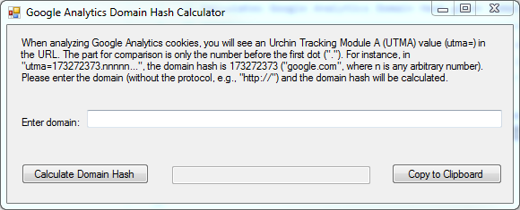

# Google Analytics Domain Hash Calculator (UTMA)

Calculates Google Analytics Domain Hash given domain name and provides simple GUI for ease of use.

When analyzing Google Analytics cookies, you will see an Urchin Tracking Module A (UTMA) value (utma=) in the URL. The part for comparison is only the number before the first dot ("."). For instance, in "utma=173272373.nnnnn...", the domain hash is 173272373 ("google.com", where n is any arbitrary number). Please enter the domain (without the protocol, e.g., "http://") and the domain hash will be calculated.

**Simple GUI interface:**

I also wrote [a C++ version of the hash function.](https://gist.github.com/danzek/8bc7820dfefa025e681bc4f4a7a02627)

For more information see https://developers.google.com/analytics/devguides/collection/analyticsjs/cookie-usage
